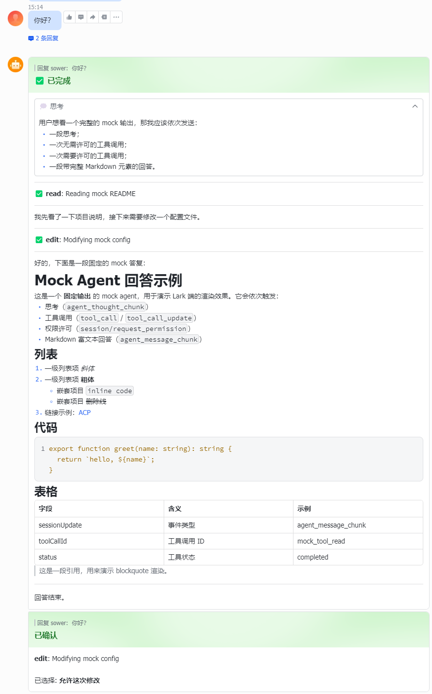

# lark-acp

[](https://www.npmjs.com/package/@4t145/lark-acp)
[](https://www.npmjs.com/package/@4t145/lark-acp)
[](https://www.npmjs.com/package/@4t145/lark-acp)
[](./LICENSE)

> ⚠️ **WIP**：仍在迭代中，1.0 之前 CLI 选项与配置字段可能继续调整。

把 [飞书/Lark](https://open.larksuite.com/) 机器人接到任何符合 [ACP（Agent Client Protocol）](https://agentcommunicationprotocol.dev/) 的 AI Agent 上：用户在飞书里发消息，agent 在你的机器上跑，过程和结果都以一张可交互的飞书卡片呈现，工具调用授权、中断、跨进程恢复会话都在卡片里完成。

<p align="center">
  
</p>

---

## CLI: `lark-acp`

### 安装与运行

```bash
# 通过 npm / npx：
npx -y @4t145/lark-acp --help

# 或在仓库内本地构建：
bun install
bun run build
node dist/bin/lark-acp.js --help
```

### 命令格式

```
lark-acp [global-options] proxy --agent <preset> [-- <extra-args>...]
lark-acp [global-options] proxy -- <agent-cmd> [agent-args...]
lark-acp agents
lark-acp help
lark-acp version
```

两种启动方式：

- **`--agent <preset>`** —— 使用内置预设，最常用。运行 `lark-acp agents` 查看完整列表。
- **`-- <agent-cmd>`** —— 自定义命令，`--` 后的所有参数原样转发给 agent。

两种方式可以组合：`proxy --agent claude -- --debug` 会在预设末尾追加 `--debug` 再启动。

全局选项必须放在 `proxy` 子命令之前。

### 内置 agent 预设

| Preset         | 说明                                                                          |
| -------------- | ----------------------------------------------------------------------------- |
| `claude`       | Claude Code，需先在终端跑过 `claude` 完成登录。                               |
| `claude-agent` | Claude Agent SDK 适配器，需要 `ANTHROPIC_API_KEY`。                           |
| `codex`        | OpenAI Codex 适配器。                                                         |
| `copilot`      | GitHub Copilot CLI。                                                          |
| `gemini`       | Google Gemini CLI（实验性）。                                                 |
| `opencode`     | OpenCode，需要 `opencode` 已在 `$PATH` 上。                                   |

不在预设里的 agent，用 raw command：

```bash
lark-acp proxy -- node ./my-acp-server.js --port 9000
```

也可以在配置文件的 `agents` 字段里固化自己的预设（详见下文「配置文件」一节）。

### 全局选项

| 选项                    | 说明                                                                                                |
| ----------------------- | --------------------------------------------------------------------------------------------------- |
| `--cwd <dir>`           | agent 工作目录（默认当前目录）                                                                      |
| `--config <path>`       | 覆盖配置文件路径                                                                                    |
| `--data-dir <dir>`      | 覆盖会话存储目录                                                                                    |
| `--idle-timeout <min>`  | 闲置 N 分钟后释放会话（`0` 表示永不，默认 1440）                                                    |
| `--max-chats <n>`       | 最大并发会话数（默认 10）                                                                           |
| `--hide-thoughts`       | 不在卡片里渲染思考过程                                                                              |
| `--hide-tools`          | 不在卡片里渲染工具调用                                                                              |
| `--hide-cancel-button`  | 不渲染卡片底部的"中断当前任务"按钮                                                                  |
| `--permission-mode <m>` | 工具授权策略：`alwaysAsk`（默认，弹卡片让用户选）/ `alwaysAllow`（自动允许）/ `alwaysDeny`（自动拒绝） |
| `-h`, `--help`          | 显示帮助                                                                                            |
| `-v`, `--version`       | 显示版本                                                                                            |

### 配置文件

CLI 读取一份配置文件（默认 `~/.config/lark-acp/config.json`），里面包含凭据和运行时默认值。优先级：CLI flag > 环境变量 > 配置文件 > 内置默认。

完整字段（都可选）：

```jsonc
{
  "credentials": {
    "appId": "cli_xxxxxxxxxxxxxxxx",
    "appSecret": "xxxxxxxxxxxxxxxxxxxxxxxxxxxxxxxx",
  },
  "dataDir": "./var/lark-acp",
  "runtime": {
    "cwd": "/work/project",
    "idleTimeoutMinutes": 1440,
    "maxChats": 10,
    "hideThoughts": false,
    "hideTools": false,
    "hideCancelButton": false,
    "permissionMode": "alwaysAsk",
  },
  "agents": {
    // 在已有的内置预设上"打补丁"——只需要写要改的字段
    "claude": {
      "env": { "ANTHROPIC_BASE_URL": "https://my-proxy.example.com" },
    },
    // 新增一个用户自己的预设——必须同时给出 label 和 command
    "my-agent": {
      "label": "My ACP Agent",
      "command": "node",
      "args": ["./my-agent.js", "--acp"],
      "description": "本地自研 agent",
      "env": { "FOO": "bar" },
    },
  },
}
```

凭据可以用环境变量代替文件：`LARK_ACP_APP_ID` / `LARK_ACP_APP_SECRET`。

`lark-acp agents` 会列出当前配置下所有可用的预设，并标出来源（`[built-in]` / `[user]` / `[overridden]`）。

> 在飞书开放平台 [开发者后台](https://open.larksuite.com/app) 创建一个"自建应用"，从「凭证与基础信息」页拿 `App ID` / `App Secret`；在「事件与回调」里把订阅模式切到 **长连接 (WebSocket)**。

### 配置示例

#### 最小配置（仅写一个文件，其它走默认）

```bash
# 1. 准备目录（首次使用时一次性执行）
mkdir -p "${XDG_CONFIG_HOME:-$HOME/.config}/lark-acp"

# 2. 写入凭据
cat > "${XDG_CONFIG_HOME:-$HOME/.config}/lark-acp/config.json" <<'EOF'
{
  "credentials": {
    "appId":     "cli_a1b2c3d4e5f60001",
    "appSecret": "xxxxxxxxxxxxxxxxxxxxxxxxxxxxxxxx"
  }
}
EOF
chmod 600 "${XDG_CONFIG_HOME:-$HOME/.config}/lark-acp/config.json"

# 3. 启动桥接
lark-acp proxy --agent claude
```

#### 完整配置（凭据 + 运行时默认值）

把常用默认值固化到文件，命令行只剩 `proxy --agent`：

```jsonc
{
  "credentials": {
    "appId": "cli_a1b2c3d4e5f60001",
    "appSecret": "xxxxxxxxxxxxxxxxxxxxxxxxxxxxxxxx",
  },
  "runtime": {
    "cwd": "/srv/projects/main",
    "idleTimeoutMinutes": 60,
    "maxChats": 20,
    "hideThoughts": true,
  },
}
```

```bash
lark-acp proxy --agent claude
```

CLI flag 会临时覆盖文件里的同名项。

#### systemd 托管

`lark-acp` 是前台进程，由进程管理器托管即可：

```ini
[Service]
Environment=LARK_ACP_APP_ID=cli_a1b2c3d4e5f60001
Environment=LARK_ACP_APP_SECRET=xxxxxxxxxxxxxxxxxxxxxxxxxxxxxxxx
ExecStart=/usr/local/bin/lark-acp --cwd /srv/projects/main proxy --agent claude
Restart=on-failure
```

### 快速示例

```bash
# 1. 接 Claude Code（最常用）
#    会话自动持久化，重启不丢上下文。
lark-acp proxy --agent claude

# 2. 接 OpenCode，工作目录指向具体项目
lark-acp --cwd /work/project proxy --agent opencode

# 3. 接 GitHub Copilot CLI，关掉思考输出
lark-acp --hide-thoughts proxy --agent copilot

# 4. 自研 ACP server
lark-acp proxy -- node ./my-acp-server.js --port 9000
```

---

## 参考

- ACP 协议：<https://agentcommunicationprotocol.dev/core-concepts/architecture>
- 飞书开放平台：<https://open.larksuite.com/document/server-docs/getting-started/getting-started>

License: MIT
