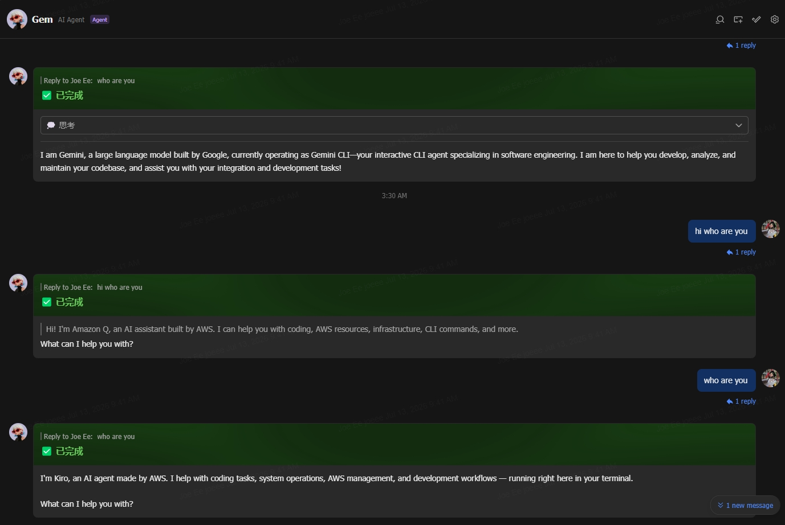

# lark-acp-bridge

[](https://www.npmjs.com/package/lark-acp-bridge)
[](https://www.npmjs.com/package/lark-acp-bridge)
[](https://www.npmjs.com/package/lark-acp-bridge)
[](./LICENSE)

**English** | **[中文](docs/README_CN.md)**

> 💡 **Credits**: this project is heavily modified and extended from the original [4t145/lark-acp](https://github.com/4t145/lark-acp) — adding native support for the Kiro and Amazon Q agents, Feishu/Lark region (domain) switching, Windows build support, and other fixes. Many thanks to [@4t145](https://github.com/4t145) for the excellent foundation.

**Turn your Feishu / Lark bot into an AI coding agent.** `lark-acp` bridges a [Feishu/Lark](https://open.larksuite.com/) bot to **any AI agent that speaks the [Agent Client Protocol (ACP)](https://agentcommunicationprotocol.dev/)** — Claude Code, Kiro CLI, OpenAI Codex, Google Gemini CLI, GitHub Copilot CLI, OpenCode, Amazon Q Developer CLI, Microsoft Copilot Studio agents, Microsoft 365 Copilot, or your own ACP server.

You send a message in Feishu/Lark; the agent runs on your machine; its thinking, tool calls, and answer stream into a single interactive Feishu card. Tool-call authorization, task interruption, and cross-restart session resume are all handled inside the card.

> 💖 Found this project useful — or just mildly interesting? A ⭐ Star in the top-right corner is the most direct encouragement you can give the author.

> ⚠️ **WIP**: still iterating — CLI options and config fields may change before 1.0.

For real-world use we strongly recommend pairing this with the [Lark CLI](https://github.com/larksuite/cli) and its skills — the bridge injects chat context (chat id, sender name, group name) into the prompt, so the agent can chain into all kinds of Lark operations through the Lark CLI.

<p align="center">
  
</p>

## Contents

- [How it works](#how-it-works)
- [Quick start](#quick-start)
- [CLI reference](#cli-reference) — [presets](#built-in-agent-presets) · [options](#global-options) · [in-chat commands](#in-chat-commands) · [config file](#configuration-file) · [env vars](#environment-variables)
- [Connecting specific agents](#connecting-specific-agents) — [Kiro](#connecting-kiro) · [Gemini](#connecting-gemini) · [Amazon Q](#connecting-amazon-q) · [Copilot Studio](#connecting-microsoft-copilot-studio) · [M365 Copilot](#connecting-microsoft-365-copilot)
- [Feishu/Lark developer console setup](#feishulark-developer-console-setup)
- [Deployment](#deployment)
- [Using as a library](#using-as-a-library)
- [Troubleshooting](#troubleshooting)

## How it works

```
 Feishu / Lark cloud                        Your machine
┌─────────────────────┐                ┌─────────────────────────────────────────┐
│  user message       │   WebSocket    │  lark-acp bridge                        │
│  card button click  │ ◄────────────► │   ├─ interpreter   (msg → ACP blocks)   │
│                     │   (long conn,  │   ├─ presenter     (ACP → Lark cards)   │
│  interactive card   │    no public   │   ├─ session store (resume across       │
│  (streamed updates) │    IP needed)  │   │                 restarts)           │
└─────────────────────┘                │   └─ ACP client ──► agent subprocess    │
                                       │       JSON-RPC 2.0    (claude / kiro    │
                                       │       over stdio       / codex / ...)   │
                                       └─────────────────────────────────────────┘
```

- **No public endpoint required** — events arrive over Lark's persistent WebSocket connection, so the bridge runs fine behind NAT, on a laptop, or in a container.
- **One card per task** — thoughts, tool calls, and the final answer are merged into a single continuously-updated card instead of flooding the chat (especially group chats) with messages.
- **Per-tool permission cards** — when the agent wants to run a tool, the bridge pops an authorization card and pauses the agent until you answer (unanswered requests auto-cancel after 5 minutes; policy configurable via [`--permission-mode`](#global-options)).
- **Session persistence** — chat → session mappings are stored on disk; agents that support ACP `session/load` / resume pick up right where they left off after a bridge restart.
- **Concurrent chats** — each Feishu chat gets its own agent session, with idle eviction (`--idle-timeout`, `--max-chats`).

---

## Quick start

**Prerequisites**: Node.js ≥ 20, a Feishu/Lark custom app ([setup below](#feishulark-developer-console-setup)), and at least one agent CLI installed and authenticated.

**1. Install** (no git clone needed):

```bash
npm i -g lark-acp-bridge
# or straight from GitHub (builds on install):
npm i -g github:wthislifehuh/lark-acp-bridge
```

Either one puts the `lark-acp` command on your `$PATH` — every example in this README uses it.

**2. Write your app credentials** (one-time):

```bash
mkdir -p "${XDG_CONFIG_HOME:-$HOME/.config}/lark-acp"
cat > "${XDG_CONFIG_HOME:-$HOME/.config}/lark-acp/config.json" <<'EOF'
{
  "credentials": {
    "appId": "cli_a1b2c3d4e5f60001",
    "appSecret": "xxxxxxxxxxxxxxxxxxxxxxxxxxxxxxxx",
    "domain": "feishu"
  }
}
EOF
chmod 600 "${XDG_CONFIG_HOME:-$HOME/.config}/lark-acp/config.json"
```

On Windows (PowerShell) the config lives at `~\.config\lark-acp\config.json` — create the same JSON there.

**3. Start the bridge**:

```bash
lark-acp proxy --agent claude          # Feishu app (open.feishu.cn)
lark-acp proxy --domain lark --agent gemini   # Lark International app (open.larksuite.com)
```

Then find the bot in Feishu/Lark — DM it, or add it to a group and @mention it.

> ⚠️ **Region matters**: if your app was created on **Lark International** (`open.larksuite.com`), set `"domain": "lark"` in the config (or pass `--domain lark`) — otherwise the handshake is rejected with error code `1000040351` ("Incorrect domain name"). The default `feishu` is for apps on `open.feishu.cn`.

> 🖱️ **On Windows and don't want to use a terminal?** [`windows/`](windows/) has a double-click `.bat` launcher per preset (`run-claude.bat`, `run-kiro.bat`, `run-q.bat`, …) — see [`windows/README.md`](windows/README.md).

<details>
<summary>Developing on the bridge itself? Run from a checkout instead.</summary>

```bash
git clone https://github.com/wthislifehuh/lark-acp-bridge
cd lark-acp-bridge
npm install && npm run build
node dist/bin/lark-acp.js proxy --agent claude
# optional: npm link   → makes the bare `lark-acp` command point at this checkout
```

</details>

## CLI reference

### Command format

```
lark-acp [global-options] proxy --agent <preset> [-- <extra-args>...]
lark-acp [global-options] proxy -- <agent-cmd> [agent-args...]
lark-acp prepare [--agent <preset>]
lark-acp service <install|uninstall|status> [--agent <preset>]
lark-acp agents
lark-acp help
lark-acp version
```

Two ways to pick an agent:

- **`--agent <preset>`** — use a built-in preset (most common). Run `lark-acp agents` for the full list.
- **`-- <agent-cmd>`** — a raw command; everything after `--` is forwarded to the agent verbatim.

They compose: `proxy --agent claude -- --debug` appends `--debug` to the preset's args before launching.

Global options must come before the `proxy` subcommand (`--domain` is also accepted after `proxy` for convenience).

### Built-in agent presets

| Preset           | Description                                                                                                                                                                                         |
| ---------------- | --------------------------------------------------------------------------------------------------------------------------------------------------------------------------------------------------- |
| `claude`         | Claude Code via Zed's ACP adapter. Run `claude` in a terminal once first to log in.                                                                                                                 |
| `claude-agent`   | Claude Agent SDK adapter — direct Anthropic API. Needs `ANTHROPIC_API_KEY`.                                                                                                                         |
| `codex`          | OpenAI Codex via Zed's ACP adapter.                                                                                                                                                                 |
| `copilot`        | GitHub Copilot CLI (native `--acp`).                                                                                                                                                                |
| `gemini`         | Google Gemini CLI (experimental `--acp`). Personal "Sign in with Google" was discontinued — use an API key instead, see [Connecting Gemini](#connecting-gemini).                                    |
| `opencode`       | OpenCode. Assumes `opencode` is on `$PATH`.                                                                                                                                                         |
| `kiro`           | Kiro CLI (native ACP via `kiro-cli acp`). Assumes `kiro-cli` is on `$PATH` and logged in. See [Connecting Kiro](#connecting-kiro).                                                                  |
| `q`              | Amazon Q Developer CLI via the bundled adapter (`q` has no native ACP). Needs `q` on `$PATH` and `q login` done. See [Connecting Amazon Q](#connecting-amazon-q).                                   |
| `copilot-studio` | Microsoft Copilot Studio agent via the bundled Direct-to-Engine adapter. Needs `COPILOT_STUDIO_*` config + a one-time login. See [Connecting Copilot Studio](#connecting-microsoft-copilot-studio). |
| `m365-copilot`   | Microsoft 365 Copilot (BizChat) via the bundled Graph Chat API adapter (preview API; needs a Copilot license). See [Connecting M365 Copilot](#connecting-microsoft-365-copilot).                    |
| `mock`           | Built-in scripted agent (thoughts / tool calls / permission cards / Markdown) for local end-to-end debugging.                                                                                       |

Agents not covered by a preset can be launched as a raw command:

```bash
lark-acp proxy -- node ./my-acp-server.js --port 9000
```

You can also persist your own presets in the config file's `agents` field (see [Configuration file](#configuration-file)).

### Global options

| Option                  | Description                                                                                                                                             |
| ----------------------- | ------------------------------------------------------------------------------------------------------------------------------------------------------- |
| `--cwd <dir>`           | Agent working directory (default: current directory)                                                                                                    |
| `--config <path>`       | Override the config file path                                                                                                                           |
| `--data-dir <dir>`      | Override the session-storage directory                                                                                                                  |
| `--domain <region>`     | Deployment region: `feishu` (default, `open.feishu.cn`) / `lark` (International, `open.larksuite.com`), or a full base URL for a self-hosted deployment |
| `--idle-timeout <min>`  | Release a chat's agent session after N idle minutes (`0` = never, default 1440)                                                                         |
| `--max-chats <n>`       | Maximum concurrent chat sessions (default 10)                                                                                                           |
| `--hide-thoughts`       | Don't render the agent's thinking process in the card                                                                                                   |
| `--hide-tools`          | Don't render tool calls in the card                                                                                                                     |
| `--hide-cancel-button`  | Don't render the "cancel current task" button at the bottom of the card                                                                                 |
| `--permission-mode <m>` | Tool authorization policy: `alwaysAsk` (default, pops a card for the user) / `alwaysAllow` (auto-approve) / `alwaysDeny` (auto-reject)                  |
| `--owner <open_id>`     | Set the bot owner. When omitted, the first user to DM the bot claims ownership ([access control](#access-control) is on by default)                     |
| `--no-access-control`   | Disable access control entirely — open the bot to everyone in the app's scope (not recommended)                                                        |
| `--identity <policy>`   | `lark-cli` [identity policy](#identity--prompt-context): `bot-only` (default) / `user-default`                                                          |
| `--inject-lark-credentials` | Inject the bot app credentials into the agent subprocess env (for `lark-cli`; off by default — see the security note)                              |
| `-h`, `--help`          | Show help                                                                                                                                               |
| `-v`, `--version`       | Show version                                                                                                                                            |

### In-chat commands

Send these directly to the bot (in a group, @mention the bot first):

| Command                               | Effect                                                                            |
| ------------------------------------- | --------------------------------------------------------------------------------- |
| `/cancel` / `/stop` / `取消` / `停止` | Interrupt the current task (the agent process stays alive; the session continues) |
| `/new` / `/restart`                   | Reset the session — the next message starts a brand-new agent session             |
| `/help` / `帮助`                      | Show the available in-chat commands                                               |
| `/status` / `状态`                    | Show the current status (identity, access, session, agent, WebSocket connection)  |
| `/config` / `配置`                    | Show the effective configuration (presentation, permission mode, access, identity) — owner/admin only |

Owner/admin-only [access-control](#access-control) commands: `/access`, `/invite user\|admin @…`, `/invite group`, `/remove …`, `/mention on\|off`.

### Configuration file

The CLI reads one config file (default `~/.config/lark-acp/config.json`) holding credentials and runtime defaults. Precedence: **CLI flag > environment variable > config file > built-in default**.

All fields are optional:

```jsonc
{
  "credentials": {
    "appId": "cli_xxxxxxxxxxxxxxxx",
    "appSecret": "xxxxxxxxxxxxxxxxxxxxxxxxxxxxxxxx",
    // Deployment region: feishu (default) / lark (International),
    // or a full base URL for a self-hosted deployment
    "domain": "feishu",
  },
  "dataDir": "./var/lark-acp",
  "runtime": {
    "cwd": "/work/project",
    "idleTimeoutMinutes": 1440,
    "maxChats": 10,
    "hideThoughts": false,
    "hideTools": false,
    "hideCancelButton": false,
    "permissionMode": "alwaysAsk",
    // WebSocket liveness watchdog window in seconds (default 60; 0 disables).
    "pingTimeoutSeconds": 60,
    // Abort a WebSocket handshake that stalls past this many ms (default 15000; 0 disables).
    "handshakeTimeoutMs": 15000,
  },
  "access": {
    // Access control is on by default; set false to open the bot to everyone.
    "enabled": true,
    // Pin the owner; when omitted the first user to DM the bot claims it.
    "ownerOpenId": "ou_xxxxxxxxxxxxxxxx",
  },
  "identity": {
    // lark-cli identity policy: "bot-only" (default) or "user-default".
    "policy": "bot-only",
    // Inject bot app credentials into the agent env (for lark-cli). Off by default.
    "injectCredentials": false,
    // Prepend a chat/sender context block to prompts. On by default.
    "promptContext": true,
  },
  "identity": {
    // lark-cli acting identity: "bot-only" (default) or "user-default".
    "policy": "bot-only",
    // Inject the bot app credentials into the agent env for lark-cli (default false).
    "injectCredentials": false,
    // Prepend a chat/sender context block to each prompt (default true).
    "promptContext": true,
  },
  "agents": {
    // Patch an existing built-in preset — only write the fields you change
    "claude": {
      "env": { "ANTHROPIC_BASE_URL": "https://my-proxy.example.com" },
    },
    // Add your own preset — must define both `label` and `command`
    "my-agent": {
      "label": "My ACP Agent",
      "command": "node",
      "args": ["./my-agent.js", "--acp"],
      "description": "Locally developed agent",
      "env": { "FOO": "bar" },
    },
  },
}
```

`lark-acp agents` lists every preset available under the current config, tagged with its source (`[built-in]` / `[user]` / `[overridden]`).

### Faster cold start: `lark-acp prepare`

Several presets (`claude`, `codex`, `copilot`, `gemini`, `claude-agent`) launch a translation shim via `npx -y <pkg>`. `npx` re-resolves the package on every spawn — adding cold-start latency and, unpinned, silently pulling whatever is "latest".

`lark-acp prepare` installs those shims **once** into `<data-dir>/shims`. After that, `proxy` launches them directly with `node` (no `npx` resolution, no network on spawn, and a version pinned by the prepared install). Nothing else changes — the same shim runs, so permission cards and every other behavior are identical.

```bash
lark-acp prepare                 # prepare every npx-based preset
lark-acp prepare --agent claude  # prepare just one
```

When a shim isn't prepared, `proxy` falls back to the original `npx` invocation, so this is purely opt-in. Native-ACP presets (`kiro`, `opencode`) and the bundled adapters (`q`, `copilot-studio`, `m365-copilot`, `mock`) don't use `npx` and need no preparation.

> Why not bundle the shims as dependencies? They're heavyweight agent packages (the Copilot/Gemini CLIs, the Zed adapters); making them hard dependencies would bloat every install — including for users who only run a native-ACP agent like Kiro. `prepare` keeps installs lean while still giving a fully offline, pinned launch path when you want it.

### Environment variables

| Variable                   | Effect                             |
| -------------------------- | ---------------------------------- |
| `LARK_ACP_APP_ID`          | Overrides `credentials.appId`      |
| `LARK_ACP_APP_SECRET`      | Overrides `credentials.appSecret`  |
| `LARK_ACP_DOMAIN`          | Overrides `credentials.domain`     |
| `LARK_ACP_CONFIG`          | Overrides the config file path     |
| `LARK_ACP_DATA_DIR`        | Overrides the session-storage dir  |
| `LARK_ACP_PERMISSION_MODE` | Overrides `runtime.permissionMode` |
| `LARK_ACP_OWNER`           | Overrides `access.ownerOpenId`     |
| `LARK_ACP_IDENTITY`        | Overrides `identity.policy`        |
| `LARK_ACP_TENANT_ID`       | Overrides `tenantId`               |

## Connecting specific agents

---
### Connecting Kiro

Kiro CLI (AWS's official successor to Amazon Q Developer CLI) supports ACP natively via `kiro-cli acp` — no adapter needed. Install [Kiro CLI](https://kiro.dev/docs/cli/), log in once, then:

```bash
lark-acp proxy --agent kiro
```

You get the full experience: per-tool permission cards, the thought/tool timeline, and session resume across bridge restarts (Kiro advertises ACP `loadSession`).

---
### Connecting Gemini

On 2026-06-18 Google discontinued the free "Sign in with Google" OAuth login of Gemini CLI for **personal accounts** (Gemini Code Assist for individuals / Google AI Pro / Ultra), steering users to [Antigravity](https://antigravity.google) instead. Picking "1. Sign in with Google" on first run of `gemini` now fails with:

```text
Failed to sign in. This client is no longer supported for Gemini Code Assist
for individuals. To continue using Gemini, please migrate to the Antigravity
suite of products: https://antigravity.google
```

The Gemini CLI itself (Apache-2.0, still maintained) keeps working with a **Gemini API key** — no Antigravity migration needed. Since this project launches `gemini` as a subprocess (`npx -y @google/gemini-cli --experimental-acp`), **put the API key in the config file** so the subprocess authenticates non-interactively:

**1. Get an API key**: open [Google AI Studio](https://aistudio.google.com/apikey), sign in, and click **Create API key** (the free tier covers the Flash models; keys look like `AIza...`).

**2. Write it into `agents.gemini.env`** (patching the built-in `gemini` preset):

```jsonc
{
  "agents": {
    "gemini": {
      // Inject the API key so the bridged subprocess skips interactive OAuth
      "env": { "GEMINI_API_KEY": "AIza..." },
    },
  },
}
```

With `GEMINI_API_KEY` set, `gemini` picks API-key auth automatically and never shows the login menu:

```bash
lark-acp proxy --agent gemini
```

> **Login menu still appears on first run?** Some versions still show the auth menu on a brand-new machine. Run `gemini` **manually** in a terminal once, select **2. Use Gemini API Key** with the arrow keys, and paste the key — the choice persists to `~/.gemini/settings.json`, after which the bridged subprocess won't prompt again.

**Notes**:

- `GOOGLE_API_KEY` and `GEMINI_API_KEY` are equivalent; when both are set the former wins.
- Free-tier rate limits are low (roughly a few hundred requests/day on the Flash models). A **Google One / AI Pro subscription does not automatically unlock paid API quota** — if you hit a 429 with `limit: 0`, attach a billing account in Google Cloud.
- Enterprises / teams can use **3. Vertex AI** from the auth menu instead (unaffected by the shutdown); set `GOOGLE_GENAI_USE_VERTEXAI=true` plus `GOOGLE_CLOUD_PROJECT` / `GOOGLE_CLOUD_LOCATION`.

---
### Connecting Amazon Q

Amazon Q Developer CLI (`q`) has **no native ACP** — AWS moved that investment to its successor, Kiro CLI (which ships native ACP via `kiro-cli acp`, see the `kiro` preset above), and stated they won't implement it for `q` ([feature request #2703](https://github.com/aws/amazon-q-developer-cli/issues/2703)). This project therefore ships a lightweight adapter, `lark-acp-q`, that translates ACP into `q chat` invocations so the classic `q` can still plug in.

**Usage** (make sure `q` is on `$PATH` and `q login` is done):

```bash
lark-acp proxy --agent q
```

**How it works**: each Feishu chat owns one adapter process, which maintains that chat's transcript in memory. On every message, the adapter replays the history as context into a fresh `q chat --no-interactive --trust-all-tools` invocation, streams the ANSI-stripped stdout back as `agent_message_chunk`s, then appends the turn to the transcript. This keeps concurrent Feishu chats isolated even when they share one `cwd` (`q`'s own `--resume` is keyed by directory and would cross-contaminate them, so it's not used). Transcripts are persisted per sessionId, so the bridge can restore them via `session/load` after a restart.

**Two inherent limitations** (capability boundaries of `q` itself, not bugs):

1. Non-interactive `q` must trust tools up front (otherwise it blocks waiting for TTY input), so **the `q` route cannot pop per-tool authorization cards** — tools are auto-approved. If you need per-tool authorization, use a native-ACP agent like `kiro` / `claude` instead.
2. `q chat` emits unstructured text (no JSON event stream), so **thoughts and tool calls are not split out** into the card timeline — the answer streams as one message.

**Optional environment variables** (set them in the config file under `agents.q.env`, or export directly):

| Variable                  | Default                      | Description                                                                                                                             |
| ------------------------- | ---------------------------- | --------------------------------------------------------------------------------------------------------------------------------------- |
| `Q_ACP_BIN`               | `q`                          | Amazon Q executable name / absolute path                                                                                                |
| `Q_ACP_MODEL`             | —                            | Passed through to `q chat --model`                                                                                                      |
| `Q_ACP_AGENT`             | —                            | Passed through to `q chat --agent` (Amazon Q custom agent / profile)                                                                    |
| `Q_ACP_TRUST_TOOLS`       | — (i.e. `--trust-all-tools`) | Set to a comma-separated list to use `--trust-tools` with only those                                                                    |
| `Q_ACP_WRAP`              | `never`                      | Passed through to `q chat --wrap`; set to an empty string to omit it                                                                    |
| `Q_ACP_EXTRA_ARGS`        | —                            | Extra args appended to `q chat` (split on whitespace; quoted args unsupported)                                                          |
| `Q_ACP_DATA_DIR`          | `~/.lark-acp/q-sessions`     | Transcript storage directory                                                                                                            |
| `Q_ACP_MAX_HISTORY`       | `24`                         | Max history messages replayed per invocation                                                                                            |
| `Q_ACP_MAX_HISTORY_CHARS` | `24000`                      | Character budget for replayed history — the whole input travels as a single argv element, so it must stay within OS command-line limits |

Example — pin the model and only trust read-only tools:

```jsonc
{
  "agents": {
    "q": {
      "env": {
        "Q_ACP_MODEL": "claude-sonnet-4",
        "Q_ACP_TRUST_TOOLS": "fs_read",
      },
    },
  },
}
```

> **Want per-tool authorization and the full thought/tool timeline?** Kiro CLI is Amazon Q's official successor with native ACP — just use `--agent kiro` (see <https://kiro.dev/docs/cli/acp/>).

#### Windows note: `q` needs WSL

The Amazon Q Developer CLI has **no native Windows build** — it only ships for Linux/macOS/WSL. There's no `apt`/`snap` package for it either (those names collide with unrelated tools); it installs from AWS's own release zip. On a Windows host, install and run `q` **inside WSL**:

```bash
# inside a WSL shell (Ubuntu 22.04+ recommended — needs glibc ≥ 2.34)
sudo apt-get update && sudo apt-get install -y unzip
curl --proto '=https' --tlsv1.2 -sSf \
  "https://desktop-release.q.us-east-1.amazonaws.com/latest/q-x86_64-linux.zip" -o q.zip
unzip q.zip && ./q/install.sh
source ~/.bashrc   # required — the installer edits ~/.bashrc, but the *current* shell already loaded its PATH before that edit
q login            # pick "Use for Free with Builder ID", confirm the device code in a browser
q whoami           # sanity check
```

**Do you have to manually open a WSL terminal every time?** `q` itself must run under Linux, but you don't have to babysit a terminal window for it — run the whole bridge process inside WSL and just trigger that from Windows in one shot. [`windows/run-q.bat`](windows/run-q.bat) does exactly this: double-click it instead of opening WSL by hand. It resolves the repo's WSL path automatically (works regardless of username/distro name) and shells in via `bash -lc`, which matters because a plain `wsl.exe q ...` often can't find `q` — only a _login_ shell sources `~/.bashrc`'s PATH edit, the same reason the very first `q` command failed in your own terminal. See [`windows/README.md`](windows/README.md) for this and one-click launchers for every other preset. For something more permanent than a batch file, run it under WSL's `systemd` (most modern WSL distros have it enabled) or `pm2`, same as any other long-lived Linux service — see the systemd example further down, just run it from inside WSL.

#### Testing the Amazon Q integration

Five layers, cheapest/fastest first — each isolates a different part of the stack, so a failure tells you exactly where to look:

**0. Automated, no `q`, no Feishu — works on Windows directly.** The suite drives the built adapter end-to-end over real ACP against a fake `q` binary:

```bash
npm test   # builds first (pretest), then vitest: unit tests + blackbox e2e in tests/
```

**1. Real `q`, standalone, no adapter (in WSL).** Confirms `q` itself accepts what the adapter will send it:

```bash
q chat --no-interactive --trust-all-tools --wrap never -- "用一句话介绍你自己"
```

**2. Adapter + real `q`, no Feishu (in WSL).** Isolates adapter↔`q` issues from Feishu entirely — pipe raw ACP JSON-RPC lines into the adapter's stdin by hand:

```bash
node dist/bin/q-acp.js
```

```json
{"jsonrpc":"2.0","id":1,"method":"initialize","params":{"protocolVersion":1,"clientCapabilities":{"fs":{"readTextFile":false,"writeTextFile":false}}}}
{"jsonrpc":"2.0","id":2,"method":"session/new","params":{"cwd":"/home/you","mcpServers":[]}}
{"jsonrpc":"2.0","id":3,"method":"session/prompt","params":{"sessionId":"<sessionId from the id:2 response>","prompt":[{"type":"text","text":"hello"}]}}
```

You should see streamed `session/update` notifications followed by `{"stopReason":"end_turn"}`.

**3. Bridge + mock agent + real Feishu (validates your Feishu app, no `q` needed).** Set up credentials per [Feishu/Lark developer console setup](#feishulark-developer-console-setup), then:

```bash
lark-acp proxy --agent mock
```

DM the bot in Feishu/Lark — you should get the scripted card with thoughts / tool calls / a permission button. This proves the Feishu side independently of Amazon Q.

**4. The real thing — bridge + `q` (inside WSL).**

```bash
lark-acp proxy --agent q
```

If running from a raw checkout (no `npm link` / global install yet), `lark-acp-q` won't be on `$PATH`, so point at it directly instead:

```bash
node dist/bin/lark-acp.js proxy -- node ./dist/bin/q-acp.js
```

In Feishu, check off in order: ① a reply card streams in; ② a follow-up question shows it remembered turn 1 (context replay working); ③ the cancel button interrupts a long answer; ④ restart the bridge, then message again — the session resumes from the persisted transcript; ⑤ `q logout` then message — you should get an "Authentication required" failure card rather than a generic crash.

---
### Connecting Microsoft Copilot Studio

[Microsoft Copilot Studio](https://copilotstudio.microsoft.com/) agents have no ACP-native CLI, so this project ships an adapter, **`lark-acp-copilot-studio`**, that bridges ACP to Microsoft's official **"Direct to Engine"** client ([`@microsoft/agents-copilotstudio-client`](https://www.npmjs.com/package/@microsoft/agents-copilotstudio-client), part of the Microsoft 365 Agents SDK). Answers stream token-by-token into the Feishu card; multi-turn context and cross-restart resume are handled by reusing the server-side conversation id. See [`docs/microsoft-copilot-plan.md`](docs/microsoft-copilot-plan.md) for the full design and the research behind it.

> **Two inherent limitations** (Copilot Studio's conversational API exposes neither, so they are not bugs): no per-tool permission cards, and no separate thought/tool timeline — the answer streams as one message.

**1. Register an Entra ID app** (one-time, in the [Azure/Entra portal](https://entra.microsoft.com)):

- _Identity → Applications → App registrations → New registration_. Single-tenant is fine. Record the **Application (client) ID** and **Directory (tenant) ID**.
- _Authentication → Add a platform → Mobile and desktop applications_, add redirect URI `http://localhost` (device-code needs a public-client platform registered).
- _API permissions → Add a permission → APIs my organization uses_ → search **Power Platform API** (appId `8578e004-a5c6-46e7-913e-12f58912df43`) → **Delegated** → **CopilotStudio → `CopilotStudio.Copilots.Invoke`** → Add. Grant admin consent if your tenant requires it.
  - If "Power Platform API" doesn't show up, register its service principal once: `az ad sp create --id 8578e004-a5c6-46e7-913e-12f58912df43` (or the PowerShell `New-MgServicePrincipal -AppId ...` equivalent), then retry.

**2. Find your agent's metadata**: in Copilot Studio open your agent → _Settings → Advanced → Metadata_ and copy **Environment ID** and **Schema name** (the schema name looks like `cr1a2_myAgent`). Publish the agent at least once.

**3. Write the config** (patching the built-in `copilot-studio` preset — all values go in `agents.copilot-studio.env`):

```jsonc
{
  "agents": {
    "copilot-studio": {
      "env": {
        "COPILOT_STUDIO_ENVIRONMENT_ID": "xxxxxxxx-xxxx-xxxx-xxxx-xxxxxxxxxxxx",
        "COPILOT_STUDIO_SCHEMA_NAME": "cr1a2_myAgent",
        "COPILOT_STUDIO_TENANT_ID": "xxxxxxxx-xxxx-xxxx-xxxx-xxxxxxxxxxxx",
        "COPILOT_STUDIO_APP_CLIENT_ID": "xxxxxxxx-xxxx-xxxx-xxxx-xxxxxxxxxxxx",
      },
    },
  },
}
```

**4. Log in once** (device-code flow — prints a code you paste at <https://microsoft.com/devicelogin>). The standalone `login` command reads its two required values from the environment (it does **not** read `config.json` — that env is only injected when the bridge spawns the adapter), so pass them inline:

```bash
# bash / WSL
COPILOT_STUDIO_TENANT_ID=<tenant-id> COPILOT_STUDIO_APP_CLIENT_ID=<client-id> lark-acp-copilot-studio login
```

```powershell
# Windows PowerShell
$env:COPILOT_STUDIO_TENANT_ID="<tenant-id>"; $env:COPILOT_STUDIO_APP_CLIENT_ID="<client-id>"; lark-acp-copilot-studio login
```

The refresh token is cached under `~/.lark-acp/copilot-studio` (the same default `COPILOT_STUDIO_DATA_DIR` the bridge uses), so once logged in you just start the bridge:

```bash
lark-acp proxy --agent copilot-studio
```

The token is refreshed silently afterwards; `lark-acp-copilot-studio logout` clears the cache.

**Environment variables** (set under `agents.copilot-studio.env`):

| Variable                            | Default                      | Description                                                                                             |
| ----------------------------------- | ---------------------------- | ------------------------------------------------------------------------------------------------------- |
| `COPILOT_STUDIO_ENVIRONMENT_ID`     | —                            | Power Platform environment id (from _Settings → Advanced → Metadata_)                                   |
| `COPILOT_STUDIO_SCHEMA_NAME`        | —                            | Agent schema name (same place)                                                                          |
| `COPILOT_STUDIO_DIRECT_CONNECT_URL` | —                            | Alternative to the two above: the "connection string" URL from _Channels_. When set, it takes priority. |
| `COPILOT_STUDIO_TENANT_ID`          | —                            | Entra directory (tenant) id                                                                             |
| `COPILOT_STUDIO_APP_CLIENT_ID`      | —                            | Entra application (client) id                                                                           |
| `COPILOT_STUDIO_CLOUD`              | `Prod`                       | Power Platform cloud (`Prod` / `Gov` / `High` / `DoD` / `Mooncake` …) for sovereign tenants             |
| `COPILOT_STUDIO_AGENT_TYPE`         | `Published`                  | `Published` or `Prebuilt`                                                                               |
| `COPILOT_STUDIO_AUTH_MODE`          | inferred                     | `device-code` (default) / `client-secret` (app-only, see note) / `static-token`                         |
| `COPILOT_STUDIO_CLIENT_SECRET`      | —                            | Client secret for `client-secret` mode                                                                  |
| `COPILOT_STUDIO_STATIC_TOKEN`       | —                            | A pre-acquired bearer token (`static-token` mode; mainly for testing)                                   |
| `COPILOT_STUDIO_LOCALE`             | agent default                | BCP-47 locale sent when starting a conversation, e.g. `zh-CN`                                           |
| `COPILOT_STUDIO_EMIT_START_EVENT`   | `true`                       | Whether the agent plays its greeting/opening topic on a new conversation                                |
| `COPILOT_STUDIO_DATA_DIR`           | `~/.lark-acp/copilot-studio` | Token cache + session-id storage directory                                                              |
| `COPILOT_STUDIO_TURN_TIMEOUT_MS`    | `300000`                     | Per-turn timeout                                                                                        |

> **App-only (unattended) auth**: `COPILOT_STUDIO_AUTH_MODE=client-secret` uses the **Application** `CopilotStudio.Copilots.Invoke` permission (needs admin consent) so no interactive login is required. Microsoft's SDK samples still warn that service-to-service is "in active development" for Copilot Studio, so availability is tenant-dependent — test it before relying on it. The default device-code mode with a dedicated service account is the reliable baseline.

---
### Connecting Microsoft 365 Copilot

[Microsoft 365 Copilot](https://m365.cloud.microsoft/chat) (the work chat, a.k.a. BizChat) is bridged by the **`lark-acp-m365`** adapter over the official **[Microsoft 365 Copilot Chat API](https://learn.microsoft.com/en-us/microsoft-365/copilot/extensibility/api/ai-services/chat/overview)** (Microsoft Graph). Answers stream into the card and are grounded in the signed-in user's work data (mail, files, meetings, chats) plus the web.

> ⚠️ **Read before you invest setup time — the Chat API is public preview with hard constraints:**
>
> - **Delegated auth only.** The bridge talks to M365 Copilot _as one signed-in user_ (the account you log in with). There is no bot/app-only identity, so every Feishu user shares that account's data scope — use a **dedicated service account** whose access is acceptable to expose.
> - **Every calling user needs a Microsoft 365 Copilot license** (~$30/user/mo). No consumer/personal Microsoft accounts.
> - **Preview (`/beta`)** — Microsoft may change it and does not support it for production.
> - **Not available in the China (21Vianet) cloud.** Check your tenant's cloud first.

**1. Register an Entra ID app** — same as the Copilot Studio steps above (single-tenant, add a **Mobile and desktop** platform with redirect `http://localhost`), but add **Microsoft Graph → Delegated** permissions — **all** of: `Sites.Read.All`, `Mail.Read`, `People.Read.All`, `OnlineMeetingTranscript.Read.All`, `Chat.Read`, `ChannelMessage.Read.All`, `ExternalItem.Read.All`. These require **admin consent**.

**2. Write the config**:

```jsonc
{
  "agents": {
    "m365-copilot": {
      "env": {
        "M365_COPILOT_TENANT_ID": "xxxxxxxx-xxxx-xxxx-xxxx-xxxxxxxxxxxx",
        "M365_COPILOT_APP_CLIENT_ID": "xxxxxxxx-xxxx-xxxx-xxxx-xxxxxxxxxxxx",
        "M365_COPILOT_TIMEZONE": "Asia/Shanghai",
      },
    },
  },
}
```

**3. Log in once, then run**. As with Copilot Studio, the standalone `login` command reads its two required values from the environment (not `config.json`):

```bash
# bash / WSL
M365_COPILOT_TENANT_ID=<tenant-id> M365_COPILOT_APP_CLIENT_ID=<client-id> lark-acp-m365 login
```

```powershell
# Windows PowerShell
$env:M365_COPILOT_TENANT_ID="<tenant-id>"; $env:M365_COPILOT_APP_CLIENT_ID="<client-id>"; lark-acp-m365 login
```

```bash
lark-acp proxy --agent m365-copilot
```

**Environment variables** (set under `agents.m365-copilot.env`):

| Variable                       | Default                    | Description                                                                |
| ------------------------------ | -------------------------- | -------------------------------------------------------------------------- |
| `M365_COPILOT_TENANT_ID`       | —                          | Entra directory (tenant) id                                                |
| `M365_COPILOT_APP_CLIENT_ID`   | —                          | Entra application (client) id                                              |
| `M365_COPILOT_TIMEZONE`        | system zone                | IANA time zone for the required `locationHint` (e.g. `Asia/Shanghai`)      |
| `M365_COPILOT_STREAMING`       | `true`                     | `true` → `chatOverStream` (SSE); `false` → the synchronous `chat` endpoint |
| `M365_COPILOT_SCOPES`          | the 7 Graph scopes         | Comma-separated override for the requested delegated scopes                |
| `M365_COPILOT_BASE_URL`        | `graph.microsoft.com/beta` | Graph base URL incl. version; override for sovereign clouds                |
| `M365_COPILOT_STATIC_TOKEN`    | —                          | A pre-acquired bearer token (skips device-code login; mainly for testing)  |
| `M365_COPILOT_DATA_DIR`        | `~/.lark-acp/m365-copilot` | Token cache + session-id storage directory                                 |
| `M365_COPILOT_TURN_TIMEOUT_MS` | `300000`                   | Per-turn timeout                                                           |

## Feishu/Lark developer console setup

Create a **custom app** on the [Feishu Open Platform](https://open.feishu.cn/app) (International: [Lark Developer](https://open.larksuite.com/app)), then configure three things — **permissions**, **events**, and **callbacks** — and publish a version.

### 1. Add permissions

Go to _Permissions & Scopes → Batch import/export scopes → Import_, paste this JSON, and save:

```json
{
  "scopes": {
    "tenant": [
      "im:message",
      "im:message.group_msg",
      "im:message.p2p_msg:readonly",
      "im:message:readonly",
      "im:message:send_as_bot",
      "im:message:update",
      "im:message.reactions:write_only",
      "im:resource",
      "im:chat:readonly",
      "cardkit:card:write",
      "contact:user.base:readonly"
    ],
    "user": []
  }
}
```

What each scope is for:

| Scope                                   | Purpose                                                                  |
| --------------------------------------- | ------------------------------------------------------------------------ |
| `im:message` / `im:message:send_as_bot` | Reply to user messages as the bot                                        |
| `im:message.group_msg`                  | Receive messages in group chats                                          |
| `im:message.p2p_msg:readonly`           | Receive messages in direct (P2P) chats                                   |
| `im:message:readonly`                   | Fetch message context (@mention resolution, rich-text expansion)         |
| `im:message:update`                     | Update interactive cards (streaming thoughts / tool calls / final state) |
| `im:message.reactions:write_only`       | Add / remove emoji reactions to mark task progress                       |
| `im:resource`                           | Download user-uploaded image / file binaries (by `message_id`)           |
| `im:chat:readonly`                      | Read group info (injected into prompt context: group name, group id)     |
| `cardkit:card:write`                    | Send / patch v2 interactive cards                                        |
| `contact:user.base:readonly`            | Read user names (injected into prompt context: sender name)              |

### 2. Add the event

Under _Events & Callbacks → Event Configuration_, switch the **subscription mode** to **Receive events through persistent connection** (no callback URL needed). Then add this one event, subscribing as the **app identity**:

| Event           | event_type              | Purpose                              |
| --------------- | ----------------------- | ------------------------------------ |
| Receive message | `im.message.receive_v1` | Every user message enters the bridge |

### 3. Add the callback

On the same page, in the "card callback" section below, add:

| Callback                | event_type            | Purpose                                                      |
| ----------------------- | --------------------- | ------------------------------------------------------------ |
| Card action interaction | `card.action.trigger` | User clicks a card button (permission options / cancel task) |

### 4. Publish a version

_Version Management & Release → Create version_, fill in the details, and submit for review / release. Choose the **app availability scope** as needed — only users inside it can find and chat with the bot.

### 5. Go

Put the `App ID` / `App Secret` into `config.json` (or the `LARK_ACP_APP_ID` / `LARK_ACP_APP_SECRET` environment variables) and run:

```bash
lark-acp proxy --agent claude
```

Then search for the bot in Feishu/Lark, DM it, or add it to a group and message it.

## Deployment

### Full config example

Persist your usual defaults in the file so the command line shrinks to `proxy --agent`:

```jsonc
{
  "credentials": {
    "appId": "cli_a1b2c3d4e5f60001",
    "appSecret": "xxxxxxxxxxxxxxxxxxxxxxxxxxxxxxxx",
    // Apps on Lark International (open.larksuite.com): use "lark"
    "domain": "feishu",
  },
  "runtime": {
    "cwd": "/srv/projects/main",
    "idleTimeoutMinutes": 60,
    "maxChats": 20,
    "hideThoughts": true,
  },
}
```

CLI flags temporarily override same-named file entries.

### Run as an OS service (`lark-acp service`)

To run the bridge unattended, `lark-acp service` generates a platform-native service definition for the current OS — a **systemd user unit** on Linux, a **launchd LaunchAgent** on macOS, or a **Task Scheduler** task on Windows:

```bash
lark-acp service install --agent claude   # write the service definition for a fixed agent
lark-acp service status                   # show where the definition lives + the query command
lark-acp service uninstall                # remove the definition
```

`install` requires `--agent <preset>` (the service runs one fixed agent) and embeds the resolved run config — it reads credentials/settings from your config file at run time, so make sure that file has valid credentials (the service won't see your shell environment). Installation only **writes the file**; it prints the exact commands to activate it (e.g. `systemctl --user enable --now lark-acp.service`) and leaves running them to you, so the tool never mutates your service manager or leaves a half-configured state. `uninstall` removes the file and prints the stop/deregister commands.

### systemd (manual)

Alternatively, `lark-acp` is a foreground process — put it under any process manager by hand:

```ini
[Service]
Environment=LARK_ACP_APP_ID=cli_a1b2c3d4e5f60001
Environment=LARK_ACP_APP_SECRET=xxxxxxxxxxxxxxxxxxxxxxxxxxxxxxxx
ExecStart=/usr/local/bin/lark-acp --cwd /srv/projects/main proxy --agent claude
Restart=on-failure
```

### Quick examples

```bash
# 1. Claude Code (most common) — sessions persist across restarts
lark-acp proxy --agent claude

# 2. Kiro CLI (native ACP, Amazon Q's official successor)
lark-acp proxy --agent kiro

# 3. OpenCode, pointing the working directory at a specific project
lark-acp --cwd /work/project proxy --agent opencode

# 4. GitHub Copilot CLI, with thought output hidden
lark-acp --hide-thoughts proxy --agent copilot

# 5. Auto-approve all tool calls (trusted sandbox)
lark-acp --permission-mode alwaysAllow proxy --agent claude

# 6. Your own ACP server
lark-acp proxy -- node ./my-acp-server.js --port 9000
```

## Using as a library

The package also exports a programmatic API for building on top of:

```ts
import { LarkBridge, FileSessionStore } from "lark-acp-bridge";

const bridge = new LarkBridge({
  lark: { appId: "cli_...", appSecret: "...", domain: "lark" },
  agent: {
    command: "kiro-cli",
    args: ["acp"],
    cwd: "/work/project",
    permissionMode: "alwaysAsk",
  },
  session: { idleTimeoutMs: 60 * 60_000, maxConcurrentChats: 20 },
  sessionStore: new FileSessionStore("./var/lark-acp"),
});

await bridge.start();
// ... later: await bridge.stop();
```

### Access control

The bundled `lark-acp` CLI enforces access control **by default**: the bridge is **private** — only the owner, admins, and allowlisted users/groups may drive it, and only a permission card's originating operator (or an owner/admin) can approve its tool call. The first user to DM the bot claims ownership unless you pin one with `--owner` / `access.ownerOpenId` / `LARK_ACP_OWNER`. Disable it with `--no-access-control` (or `access.enabled: false`) to fall back to the open behavior where anyone in the app's scope can use the bot.

When embedding the library directly, access control is **opt-in** — construct an `AccessControl` and pass it to `LarkBridge` (omit it to run open):

```ts
import { LarkBridge, FileSessionStore, AccessControl, FileAccessStore } from "lark-acp-bridge";

const accessControl = new AccessControl({
  store: new FileAccessStore("./var/lark-acp"), // allowlist state file, atomically written
  logger,
  // Optional: pin the owner. When set it always wins and can never be locked out.
  // When omitted, the first user to DM the bot claims ownership (self-host bootstrap).
  configuredOwner: "ou_owner_open_id",
});

const bridge = new LarkBridge({
  lark: { appId: "cli_...", appSecret: "...", domain: "lark" },
  agent: { command: "kiro-cli", args: ["acp"] },
  sessionStore: new FileSessionStore("./var/lark-acp"),
  accessControl,
});
```

With access control enabled, the owner and admins get these extra privileged in-chat commands (in a group, @mention the bot first):

| Command                                          | Effect                                                                       |
| ------------------------------------------------ | ---------------------------------------------------------------------------- |
| `/access`                                        | Show the current owner, admins, allowed users, allowed groups, and settings  |
| `/invite user @…` / `/invite admin @…`           | Add the @mentioned users to the user / admin allowlist                       |
| `/invite group`                                  | Allow the current group chat                                                 |
| `/remove user @…` / `/remove admin @…`           | Remove users / demote admins (the owner can never be removed)                |
| `/remove group`                                  | Disallow the current group chat                                              |
| `/mention on` / `/mention off`                   | Toggle whether group messages must @mention the bot to be handled            |

Allowlist changes are persisted to a `dataDir` state file (`access.json`, atomically written) and take effect on the next message without a restart. Every access decision and mutation is emitted through the audit logger (see below).

### Multi-tenant groundwork

The bridge lays cheap, non-breaking seams for a future hosted / multi-tenant deployment (see `docs/architecture-and-scaling-plan.md` §6), all with single-tenant defaults so existing behavior is unchanged:

- **Explicit tenant id** — every log line and audit record is keyed by `tenantId` (default `"default"`; set via `tenantId` / `LARK_ACP_TENANT_ID`), so a hosted deployment can run one bridge per tenant without a rewrite.
- **Transport seam** — inbound events arrive through a `LarkTransport` built by a `LarkTransportFactory`. The default is the WebSocket long connection; a hosted/ISV deployment can inject a webhook receiver instead by passing `transportFactory`.
- **Audit sink** — security events (access decisions, allowlist mutations, tool authorizations) flow through a pluggable `AuditLogger`. The default `LoggerAuditLogger` writes tenant-tagged `audit: true` records through the structured logger; swap it for a per-tenant retained sink.
- **Agent execution** already sits behind the ACP boundary, so a hosted-model executor can replace subprocess spawning without touching the bridge.

### Identity & prompt context

The bridge tells the agent **who is asking and how Lark skills should authenticate**, so an agent that shells into a Lark tool (e.g. `lark-cli`) has the right chat/user ids and identity:

- **Prompt-context injection** (on by default) — a structured block is prepended to the first message of each turn describing the chat (type, id, name), the sender (name + `open_id`), and the active identity policy.
- **`lark-cli` identity policy** — `bot-only` (default) runs Lark skills as the app/tenant token; `user-default` signals that personal-resource access should be performed as the requesting user. The policy and a managed `dataDir/lark-cli` config directory are exposed to the agent subprocess via `LARK_ACP_*` environment variables (`LARK_ACP_IDENTITY_POLICY`, `LARK_ACP_CHAT_ID`, `LARK_ACP_CONFIG_DIR`, `LARK_ACP_DOMAIN`).

Set the policy with `--identity`, `identity.policy`, or `LARK_ACP_IDENTITY`.

> **Security & scope.** Because the agent subprocess inherits the bridge's environment, credential injection is an explicit opt-in (`--inject-lark-credentials` / `identity.injectCredentials`) — enabling it exposes `LARK_ACP_APP_ID` / `LARK_ACP_APP_SECRET` to every tool the agent runs. Under `bot-only` the assistant reads Lark data as the app token, so keep the bot's tenant scopes minimal (plan §4.2). Genuine per-user `user_access_token` acquisition for `user-default` is a Phase-2 concern; today it *signals* the intended acting identity to the agent rather than exchanging a user token.

When embedding the library, pass an `Identity` to `LarkBridge` (omit it to keep the built-in minimal context block and inject no identity env):

```ts
import { LarkBridge, FileSessionStore, Identity } from "lark-acp-bridge";

const identity = new Identity({
  policy: "bot-only",
  configDir: "./var/lark-acp/lark-cli",
  injectCredentials: false,
  injectPromptContext: true,
  appId: "cli_...",
  appSecret: "...",
  domain: "lark",
  logger,
});

const bridge = new LarkBridge({
  lark: { appId: "cli_...", appSecret: "...", domain: "lark" },
  agent: { command: "kiro-cli", args: ["acp"] },
  sessionStore: new FileSessionStore("./var/lark-acp"),
  identity,
});
```

### Tenancy & audit logging

`LarkBridge` accepts an optional `tenantId` (defaults to `"default"` in single-tenant mode). Every log line the bridge and its children emit — and every audit record — is tagged with it, so a multi-tenant deployment can run one bridge per tenant without a rewrite (Phase-2 groundwork).

Two further injection points support that direction and default to today's behavior when omitted:

- `auditLogger` — a sink for security-relevant events (access decisions, allowlist mutations, tool authorizations). Defaults to a logger-backed sink that writes `audit`-tagged, tenant-tagged log lines; supply your own to route them to a separate retained store.
- `transportFactory` — builds the inbound-event transport. Defaults to the WebSocket long connection; inject your own (e.g. an ISV/webhook receiver) to change how events arrive.

```ts
const bridge = new LarkBridge({
  lark: { appId: "cli_...", appSecret: "...", domain: "lark" },
  agent: { command: "kiro-cli", args: ["acp"] },
  sessionStore: new FileSessionStore("./var/lark-acp"),
  tenantId: "acme-corp",
});
```

Main exports:

- `LarkBridge` — the orchestrator; one instance per process.
- `AccessControl` / `FileAccessStore` — opt-in intake + card-action access control (private-by-default owner/admin/user/group allowlists).
- `Identity` — `lark-cli` identity policy + prompt-context injection (`bot-only` / `user-default`).
- `AuditLogger` / `LoggerAuditLogger` — pluggable, tenant-tagged audit sink for security events.
- `LarkTransport` / `LarkTransportFactory` — the inbound-event transport seam (WebSocket by default; inject your own).
- `LarkPresenter` / `LarkCardPresenter` — the pluggable UI surface (swap in your own card rendering).
- `SessionStore` / `FileSessionStore` — persistent chat → session mapping.
- `LarkLogger` / `createPinoLogger` — structured logging.
- `LarkHttpClient`, `LARK_DOMAINS`, `resolveLarkDomain` — Lark HTTP client and region helpers.

## Troubleshooting

**`[ws] code: 1000040351, Incorrect domain name`** — your app lives on Lark International (`open.larksuite.com`) but the bridge is connecting to Feishu (the default). Set `--domain lark`, `credentials.domain: "lark"`, or `LARK_ACP_DOMAIN=lark`. (The reverse also holds: a Feishu app with `domain: "lark"` fails the same way.) Note: the upstream `@4t145/lark-acp` npm package does **not** have this setting — make sure you installed **this** package (`lark-acp-bridge`).

**`Failed to initialize agent (...). Is the agent installed?`** — the agent subprocess didn't complete the ACP handshake. The error includes the agent's recent stderr; the usual causes are the CLI not being installed / not on `$PATH`, or not logged in yet. Run the preset's command by hand (e.g. `kiro-cli acp`, `npx -y @zed-industries/claude-code-acp`) to see the raw failure.

**Gemini: `Failed to sign in. This client is no longer supported...`** — Google discontinued personal-account OAuth for Gemini CLI; switch to an API key as described in [Connecting Gemini](#connecting-gemini).

**Bot doesn't respond in Feishu** — check, in order: the app version is published and you're inside its availability scope; the event subscription mode is **persistent connection** with `im.message.receive_v1` added; all [permissions](#1-add-permissions) are imported and approved.

## Credits & similar projects

This project is a fork of [4t145/lark-acp](https://github.com/4t145/lark-acp) (which itself was refactored from [JiaqiZhang-Dev/lark-acp](https://github.com/JiaqiZhang-Dev/lark-acp)). Related implementations:

1. The original this fork is based on: <https://github.com/4t145/lark-acp>
2. A Go implementation, also quite complete: <https://github.com/ri-char/Lark-ACP>
3. Another Node implementation: <https://github.com/JiaqiZhang-Dev/lark-acp>

### What this fork adds on top of the original

1. `kiro` preset (native ACP via `kiro-cli acp`) and the bundled `lark-acp-q` adapter for Amazon Q.
2. Feishu/Lark region switching (`--domain` / `credentials.domain` / `LARK_ACP_DOMAIN`) — required for apps on Lark International.
3. Cross-platform (Windows-safe) build, plus assorted fixes and doc overhauls.

---

## References

- ACP protocol: <https://agentcommunicationprotocol.dev/core-concepts/architecture>
- Feishu/Lark Open Platform: <https://open.larksuite.com/document/server-docs/getting-started/getting-started>

License: MIT
